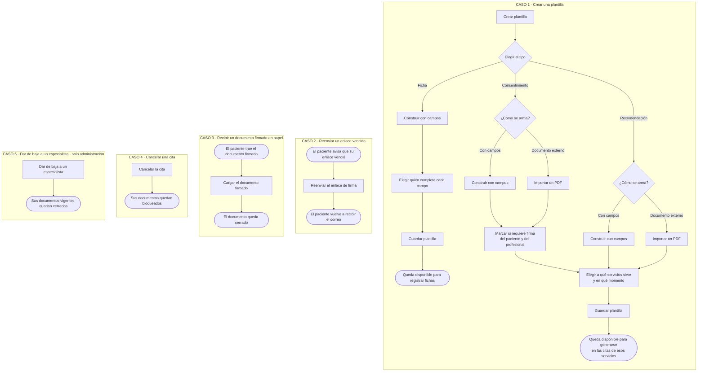
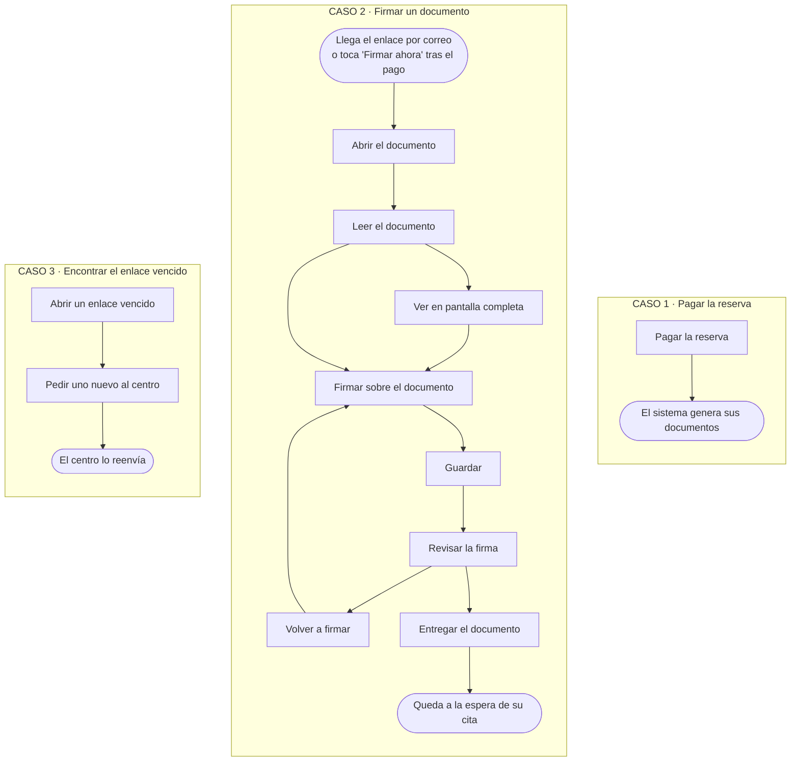
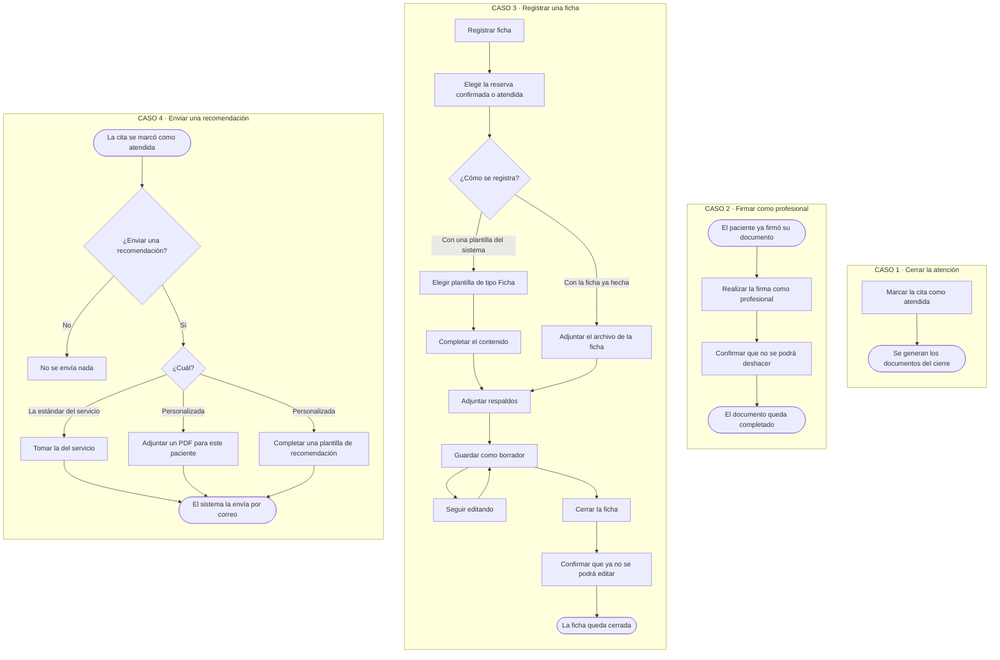
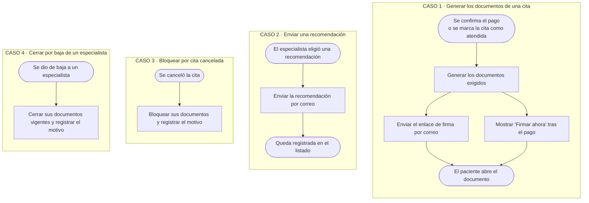
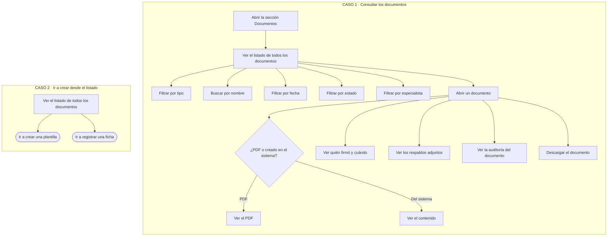

# Sección "Documentos" — Flujo por actor

## Administración y Especialista

```mermaid
flowchart TD
    subgraph AC1["CASO 1 · Crear una plantilla"]
        direction TB
        CP1["Crear plantilla"] --> CP2{"Elegir el tipo"}

        CP2 -->|Ficha| CP3["Construir con campos"]
        CP3 --> CP4["Elegir quién completa cada campo"]
        CP4 --> CP5["Guardar plantilla"]
        CP5 --> CP6(["Queda disponible para registrar fichas"])

        CP2 -->|Consentimiento| CP7{"¿Cómo se arma?"}
        CP7 -->|Con campos| CP8["Construir con campos"]
        CP7 -->|Documento externo| CP9["Importar un PDF"]
        CP8 --> CP10["Marcar si requiere firma<br/>del paciente y del profesional"]
        CP9 --> CP10
        CP10 --> CP14["Elegir a qué servicios sirve<br/>y en qué momento"]

        CP2 -->|Recomendación| CP11{"¿Cómo se arma?"}
        CP11 -->|Con campos| CP12["Construir con campos"]
        CP11 -->|Documento externo| CP13["Importar un PDF"]
        CP12 --> CP14
        CP13 --> CP14

        CP14 --> CP15["Guardar plantilla"]
        CP15 --> CP16(["Queda disponible para generarse<br/>en las citas de esos servicios"])
    end

    subgraph AC2["CASO 2 · Reenviar un enlace vencido"]
        direction TB
        AD10(["El paciente avisa que su enlace venció"]) --> AD11["Reenviar el enlace de firma"]
        AD11 --> AD12(["El paciente vuelve a recibir el correo"])
    end

    subgraph AC3["CASO 3 · Recibir un documento firmado en papel"]
        direction TB
        AD13(["El paciente trae el documento firmado"]) --> AD14["Cargar el documento firmado"]
        AD14 --> AD15(["El documento queda cerrado"])
    end

    subgraph AC4["CASO 4 · Cancelar una cita"]
        direction TB
        AD16["Cancelar la cita"] --> AD17(["Sus documentos quedan bloqueados"])
    end

    subgraph AC5["CASO 5 · Dar de baja a un especialista · solo administración"]
        direction TB
        AD18["Dar de baja a un especialista"] --> AD19(["Sus documentos vigentes quedan cerrados"])
    end
```

## Paciente

```mermaid
flowchart TD
    subgraph PC1["CASO 1 · Pagar la reserva"]
        direction TB
        PA1["Pagar la reserva"] --> PA2(["El sistema genera sus documentos"])
    end

    subgraph PC2["CASO 2 · Firmar un documento"]
        direction TB
        PA3(["Llega el enlace por correo<br/>o toca 'Firmar ahora' tras el pago"]) --> PA4["Abrir el documento"]
        PA4 --> PA5["Leer el documento"]
        PA5 --> PA6["Ver en pantalla completa"]
        PA6 --> PA7["Firmar sobre el documento"]
        PA5 --> PA7
        PA7 --> PA8["Guardar"]
        PA8 --> PA9["Revisar la firma"]
        PA9 --> PA10["Volver a firmar"]
        PA10 --> PA7
        PA9 --> PA11["Entregar el documento"]
        PA11 --> PA12(["Queda a la espera de su cita"])
    end

    subgraph PC3["CASO 3 · Encontrar el enlace vencido"]
        direction TB
        PA13["Abrir un enlace vencido"] --> PA14["Pedir uno nuevo al centro"]
        PA14 --> PA15(["El centro lo reenvía"])
    end
```

## Especialista

```mermaid
flowchart TD
    subgraph EC1["CASO 1 · Cerrar la atención"]
        direction TB
        ES1["Marcar la cita como atendida"] --> ES2(["Se generan los documentos del cierre"])
    end

    subgraph EC2["CASO 2 · Firmar como profesional"]
        direction TB
        ES3(["El paciente ya firmó su documento"]) --> ES4["Realizar la firma como profesional"]
        ES4 --> ES5["Confirmar que no se podrá deshacer"]
        ES5 --> ES6(["El documento queda completado"])
    end

    subgraph EC3["CASO 3 · Registrar una ficha"]
        direction TB
        RF1["Registrar ficha"] --> RF2["Elegir la reserva confirmada o atendida"]
        RF2 --> RF3{"¿Cómo se registra?"}
        RF3 -->|Con una plantilla del sistema| RF4["Elegir plantilla de tipo Ficha"]
        RF4 --> RF5["Completar el contenido"]
        RF3 -->|Con la ficha ya hecha| RF6["Adjuntar el archivo de la ficha"]
        RF5 --> RF7["Adjuntar respaldos"]
        RF6 --> RF7
        RF7 --> RF8["Guardar como borrador"]
        RF8 --> RF9["Seguir editando"]
        RF9 --> RF8
        RF8 --> RF10["Cerrar la ficha"]
        RF10 --> RF11["Confirmar que ya no se podrá editar"]
        RF11 --> RF12(["La ficha queda cerrada"])
    end

    subgraph EC4["CASO 4 · Enviar una recomendación"]
        direction TB
        ES17(["La cita se marcó como atendida"]) --> ES18{"¿Enviar una recomendación?"}
        ES18 -->|No| ES19["No se envía nada"]
        ES18 -->|Sí| ES20{"¿Cuál?"}
        ES20 -->|La estándar del servicio| ES21["Tomar la del servicio"]
        ES20 -->|Personalizada| ES22["Adjuntar un PDF para este paciente"]
        ES20 -->|Personalizada| ES23["Completar una plantilla de recomendación"]
        ES21 --> ES24(["El sistema la envía por correo"])
        ES22 --> ES24
        ES23 --> ES24
    end
```

## Sistema

```mermaid
flowchart TD
    subgraph SC1["CASO 1 · Generar los documentos de una cita"]
        direction TB
        SI1(["Se confirma el pago<br/>o se marca la cita como atendida"]) --> SI2["Generar los documentos exigidos"]
        SI2 --> SI3["Enviar el enlace de firma por correo"]
        SI2 --> SI4["Mostrar 'Firmar ahora' tras el pago"]
        SI3 --> SI5(["El paciente abre el documento"])
        SI4 --> SI5
    end

    subgraph SC2["CASO 2 · Enviar una recomendación"]
        direction TB
        SI6(["El especialista eligió una recomendación"]) --> SI7["Enviar la recomendación por correo"]
        SI7 --> SI8(["Queda registrada en el listado"])
    end

    subgraph SC3["CASO 3 · Bloquear por cita cancelada"]
        direction TB
        SI9(["Se canceló la cita"]) --> SI10["Bloquear sus documentos y registrar el motivo"]
    end

    subgraph SC4["CASO 4 · Cerrar por baja de un especialista"]
        direction TB
        SI11(["Se dio de baja a un especialista"]) --> SI12["Cerrar sus documentos vigentes y registrar el motivo"]
    end
```

## Consulta · cualquier integrante del personal

```mermaid
flowchart TD
    subgraph CC1["CASO 1 · Consultar los documentos"]
        direction TB
        CO1["Abrir la sección Documentos"] --> CO2["Ver el listado de todos los documentos"]
        CO2 --> CO3["Filtrar por tipo"]
        CO2 --> CO4["Buscar por nombre"]
        CO2 --> CO5["Filtrar por fecha"]
        CO2 --> CO6["Filtrar por estado"]
        CO2 --> CO7["Filtrar por especialista"]
        CO2 --> CO8["Abrir un documento"]
        CO8 --> CO9{"¿PDF o creado en el sistema?"}
        CO9 -->|PDF| CO10["Ver el PDF"]
        CO9 -->|Del sistema| CO11["Ver el contenido"]
        CO8 --> CO12["Ver quién firmó y cuándo"]
        CO8 --> CO13["Ver los respaldos adjuntos"]
        CO8 --> CO14["Ver la auditoría del documento"]
        CO8 --> CO15["Descargar el documento"]
    end

    subgraph CC2["CASO 2 · Ir a crear desde el listado"]
        direction TB
        CO16["Ver el listado de todos los documentos"] --> CO17(["Ir a crear una plantilla"])
        CO16 --> CO18(["Ir a registrar una ficha"])
    end
```
