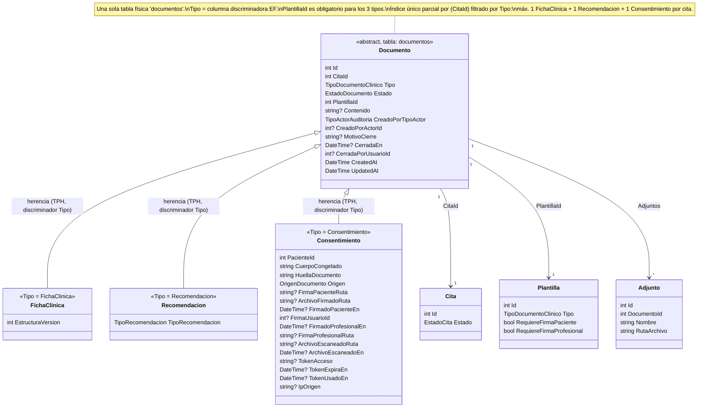

# Plan de implementación — Reglas de negocio backend, refactor "Documentos"

## Contexto

El documento `Flujo Seccion Documentos - Refactor de Seccion Fichas Clinicas.md` es la fuente de verdad; `Plan de Refactor - Seccion Documentos.md` lo desarrolla y aclara que el problema raíz es conceptual: **Documento es la entidad general; Ficha, Consentimiento y Recomendación son tipos, no entidades paralelas**. Hoy el backend (`kinefit-backend/api-dotnet`) representa esto con dos tablas separadas (`fichas_clinicas` con un campo `Tipo` que mezcla Ficha y Recomendación, y `documentos_paciente` para Consentimiento) más una vista SQL (`vista_documentos`) que las une a mano con un UNION ALL y una clave compuesta (`FIC-1`/`DOC-7`) para simular una sola lista. Esa vista es un parche sobre un modelo mal planteado, y es la causa directa de varios de los problemas que este refactor busca resolver.

Además, el código hoy reparte esta funcionalidad en controladores/servicios/repositorios paralelos sin una razón conceptual (`FormatoFichaController`, `FichaClinicaController`, `DocumentoController`, cada uno con su propio servicio) — otro síntoma del mismo problema raíz: no hay una sola noción de "Documento" en el código, así que no hay un solo lugar donde vive su lógica.

Decisión confirmada: **se reemplaza esto por herencia real** — una entidad base `Documento` con tres hijos (`FichaClinica`, `Recomendacion`, `Consentimiento`), usando la estrategia EF Core **TPH (Table-Per-Hierarchy)**, una sola tabla física `documentos` con columna discriminadora — y **se consolida todo el módulo en una sola capa de cada tipo**: un único `DocumentoController`, un único `DocumentoService`, un único `DocumentoRepository`, que cubren Documento (sus tres tipos), Plantilla y la asignación Plantilla-Servicio.

Este plan cubre **solo backend** (reglas de negocio + el cambio de modelo y de organización de archivos que las sostiene). Frontend, vista pública de firma, constructor de plantillas (su lógica de armado de campos) y asistente de registro quedan fuera, según indica el documento de refactor.

---

## Decisiones de diseño confirmadas con el usuario

1. **Herencia TPH**, no dos tablas ni TPT/TPC. El listado unificado pasa a ser una query sobre una sola tabla, las columnas específicas de cada subtipo se vuelven nullable en la tabla compartida, y la migración de datos existentes es más simple que TPT (que necesitaría joins) o TPC (que duplicaría columnas base).
2. **Se elimina por completo `vista_documentos`** (modelo `VistaDocumento`, la vista SQL, y la clave compuesta `FIC-`/`DOC-`). El listado usa el id entero real de `documentos` + el campo `Tipo` para diferenciar.
3. **Las rutas se renombran directo**: todo lo que hoy vive bajo `api/fichas/*` y `api/formatos-ficha/*` (o el nombre que tenga hoy) pasa a `api/documentos/*`, sin capa de compatibilidad temporal — backend y frontend se actualizan juntos en este ciclo.
4. **Regla de unicidad por cita**: como máximo 1 `FichaClinica`, 1 `Recomendacion` y 1 `Consentimiento` por cita — tres restricciones independientes.
5. **Visibilidad**: un especialista **lee todos** los documentos (listado, detalle, historial por paciente, descarga de adjuntos) pero **crea/edita solo los suyos**.
6. **`DocumentoPaciente` se renombra a `Consentimiento`**, como hijo de `Documento`.
7. **Quién creó el documento — atributo genérico en la clase padre**: `Documento` guarda quién lo originó como actor genérico, reutilizando el patrón que ya existe en auditoría (`TipoActorAuditoria { Sistema, Paciente, Personal }`): `CreadoPorTipoActor` + `CreadoPorActorId`. Así una `FichaClinica` registra que la creó un Personal, un `Consentimiento` registra que lo creó el Sistema, sin inventar un dato falso.
8. **`FormatoFicha` se renombra a `Plantilla`** en todo el backend (modelo, campos FK, servicio, controlador) — el documento de refactor lo pide explícitamente ("Se renombra 'Formato' a 'Plantilla' en toda la interfaz"), y este backend hoy todavía usa el nombre viejo.
9. **`FichaAdjunto` se renombra a `Adjunto`** — ya no hace falta el prefijo "Ficha" porque el adjunto cuelga de cualquier `Documento`, no solo de una ficha.
10. **La plantilla es obligatoria al crear cualquier documento**, incluida la Ficha — corrección sobre la versión anterior de este plan: el flujo de "Registrar ficha" (`ES9 Elegir plantilla de tipo Ficha`) muestra que elegir plantilla es un paso obligatorio, no opcional. `PlantillaId` deja de ser nullable en `Documento`.
11. **Firma del profesional siempre manual, nunca reutilizada**: se elimina cualquier mecanismo de guardar una firma para reutilizarla con un botón ("estampar"). Cada vez que el especialista firma, dibuja la firma en el momento para ese documento puntual — igual que ya hace el paciente hoy. El campo que guarda esa imagen (`FirmaProfesionalRuta`) es un archivo nuevo por cada firma, nunca uno reutilizado entre documentos; no debe confundirse con el mecanismo viejo de firma reutilizable que sí se elimina por completo.
12. **Consolidación de archivos por capa**: se elimina la dispersión actual (`FormatoFichaController`/`Service`, `FichaClinicaController`/`Service`, `DocumentoController`/`Service`, cada uno con su propio acceso a datos disperso) en favor de **un único archivo por capa para todo el módulo**: `DocumentoController`, `DocumentoService`, `DocumentoRepository` (más sus interfaces `IDocumentoService`/`IDocumentoRepository`). Cubren: los tres tipos de Documento, el CRUD de Plantilla, y la asignación Plantilla↔Servicio (hoy `ServicioDocumento`).

---

## 0.1 Diagrama del modelo (foco en Ficha, con sus hermanos para contexto)



**Notas sobre el diagrama:**
- `Documento` es la tabla física real (TPH = una sola tabla `documentos`); `FichaClinica`, `Recomendacion` y `Consentimiento` son el mismo registro visto según su `Tipo`.
- `Recomendacion` expone su variante (Estándar/Personalizada) como `TipoRecomendacion` (enum `TipoRecomendacion`), no como `Tipo` a secas — ese nombre ya lo usa `Documento` para el discriminador (`TipoDocumentoClinico`); usar el mismo nombre en la clase hija lo taparía (shadowing) y sería confuso. Es un ajuste técnico necesario para poder aplicar tu pedido de renombrar `Variante`→`Tipo` sin choque de nombres.
- `PlantillaId` es obligatorio (no nullable) en los tres tipos.
- `CreadoPorTipoActor` + `CreadoPorActorId` viven en el padre `Documento`.
- `Adjunto` apunta a `DocumentoId` (un solo FK al padre), por lo que cualquier hijo puede tener adjuntos sin lógica condicional.

---

## 0. Modelo nuevo

### `src/Domain/Models/Documento.cs` (nuevo, base — tabla `documentos`)
```
Id
CitaId, Cita (nav)
Tipo (TipoDocumentoClinico)              // discriminador EF: FichaClinica | Recomendacion | Consentimiento
Estado (EstadoDocumento — enum unificado nuevo, ver abajo)
PlantillaId, Plantilla (nav)              // OBLIGATORIO para los 3 tipos
Contenido (string?, jsonb)
CreadoPorTipoActor (TipoActorAuditoria)
CreadoPorActorId (int?)
MotivoCierre (string?)
CerradaEn (DateTime?)
CerradaPorUsuarioId (int?), CerradaPorUsuario (nav?)
CreatedAt, UpdatedAt
Adjuntos (ICollection<Adjunto>)           // vía Adjunto.DocumentoId
```

### `EstadoDocumento` (enum unificado)
```
Borrador            // Ficha/Recomendacion recién creada, editable
Pendiente           // Consentimiento esperando firma
Completado          // Ficha cerrada explícitamente; Consentimiento firmado/completo
Bloqueado           // cita cancelada
CerradoPorBaja      // especialista dado de baja
Anulado             // reservado, uso existente en Consentimiento
```

### `src/Domain/Models/FichaClinica.cs` (hijo)
```
EstructuraVersion (int, default 1)
```

### `src/Domain/Models/Recomendacion.cs` (nuevo hijo)
```
TipoRecomendacion (enum TipoRecomendacion: Estandar, Personalizada)
```

### `src/Domain/Models/Consentimiento.cs` (nuevo hijo, reemplaza `DocumentoPaciente.cs`)
```
PacienteId, Paciente (nav)
CuerpoCongelado, HuellaDocumento
Origen (OrigenDocumento)
FirmaPacienteRuta?, ArchivoFirmadoRuta?, FirmadoPacienteEn?
FirmaUsuarioId?, FirmaUsuario (nav?)
FirmadoProfesionalEn?
FirmaProfesionalRuta?      // archivo de la firma dibujada EN ESE MOMENTO por el profesional, uno nuevo por documento — no se reutiliza, no reemplaza el mecanismo viejo de "estampar" (ese se elimina, ver decisión 11)
ArchivoEscaneadoRuta?
ArchivoEscaneadoEn?
TokenAcceso?, TokenExpiraEn?, TokenUsadoEn?
IpOrigen?
```

### `src/Domain/Models/Plantilla.cs` (renombrado desde `FormatoFicha.cs`)
```
Id, Nombre (unique)
Tipo (TipoDocumentoClinico)
Origen (OrigenFormato)
Cuerpo (string?, jsonb)
ArchivoRutaInterna?
RequiereFirmaPaciente (bool)
RequiereFirmaProfesional (bool)
Activo (bool)
CreatedAt, UpdatedAt
```
Todas las referencias `FormatoFichaId` en el resto del modelo (`ServicioDocumento`, `Documento`) pasan a `PlantillaId`.

### `Adjunto` (renombrado desde `FichaAdjunto`)
Un único FK `DocumentoId` (a `Documento`), sin dual-FK ni condicionales — cualquier hijo puede tener adjuntos.

---

## 1. Migraciones (orden estricto)

1. **`AddDocumentoHierarchy`** — crea tabla `documentos` (base + columnas de los 3 subtipos, todas nullable salvo las compartidas y `PlantillaId` que es obligatoria), columna discriminadora `tipo`, columnas nuevas (`estado`, `motivo_cierre`, `cerrada_en`, `cerrada_por_usuario_id`, `creado_por_tipo_actor`, `creado_por_actor_id`, `tipo_recomendacion`, `firma_profesional_ruta`, `archivo_escaneado_en`). Renombra tabla `formatos_ficha` → `plantillas` y su columna `formato_ficha_id` en `servicio_documentos` → `plantilla_id`.
2. **`MigrateDocumentoDataFromLegacyTables`** — copia `fichas_clinicas` → `documentos` preservando IDs (`CreadoPorTipoActor=Personal`, `CreadoPorActorId = CreadoPorUsuarioId`, `Estado=Completado` para todo lo existente). Copia `documentos_paciente` → `documentos` con id desplazado (`CreadoPorTipoActor=Sistema`, `CreadoPorActorId=null`, mapeo directo de `EstadoDocumento` viejo → nuevo). Registra mapeo id-viejo→id-nuevo en columna temporal.
3. **`RepointAdjuntoToDocumento`** — agrega `documento_id` a la tabla de adjuntos (renombrada `ficha_adjuntos`→`adjuntos`), lo llena con el mapeo, lo vuelve `NOT NULL` + FK, elimina `ficha_clinica_id` y su FK.
4. **`DropLegacyDocumentTablesAndView`** (gate manual): `DROP VIEW vista_documentos`, `DROP TABLE fichas_clinicas`, `DROP TABLE documentos_paciente`, limpia columnas temporales. Se corre solo tras validar en un respaldo que 2-3 no perdieron filas ni rompieron FKs.

---

## 2. Índices de unicidad por tipo

Tres índices únicos parciales sobre `documentos`, filtrados por discriminador:
- único por `CitaId` donde `Tipo = FichaClinica`
- único por `CitaId` donde `Tipo = Recomendacion`
- único por `CitaId` donde `Tipo = Consentimiento`

Resuelve el bug actual (índice único sobre `CitaId` solo, que impide tener Ficha + Recomendación en la misma cita). "Personalizada reemplaza a Estándar" se cumple gratis con este mismo índice: el cambio de `TipoRecomendacion` es un `UPDATE` en el mismo registro, no un segundo insert.

---

## 3. Consolidación de archivos: un único Controller/Service/Repository para todo el módulo

Se elimina la dispersión actual (`FormatoFichaController`+`FormatoFichaService`, `FichaClinicaController`+`FichaClinicaService`, `DocumentoController`+`DocumentoService`, más los repositorios/repos parciales que cada uno usaba) y se reemplaza por tres archivos:

### `src/Domain/Repositories/IDocumentoRepository.cs` + `src/Infrastructure/Repositories/DocumentoRepository.cs`
Único punto de acceso a datos para todo el módulo, organizado en grupos de métodos dentro del mismo archivo:
- **Documentos**: `GetByIdAsync`, `GetByCitaIdYTipoAsync`, `GetAllAsync` (listado paginado con filtros), `GetByPacienteIdAsync` (historial), `AddAsync`, `UpdateAsync`.
- **Plantillas**: `GetPlantillaByIdAsync`, `GetPlantillasAsync`, `AddPlantillaAsync`, `UpdatePlantillaAsync`.
- **Asignación Plantilla↔Servicio** (`ServicioDocumento`): `GetAsignacionesPorServicioAsync`, `AddAsignacionAsync`, `UpdateAsignacionAsync`.
- **Adjuntos**: `GetAdjuntoByIdAsync`, `AddAdjuntoAsync`, `DeleteAdjuntoAsync`.

Reemplaza: `FichaClinicaRepository`/`IFichaClinicaRepository`, cualquier acceso a datos disperso dentro de `FormatoFichaService`, y el acceso directo a `_context` que hoy hace `DocumentoService`.

### `src/Application/Services/Interfaces/IDocumentoService.cs` + `src/Application/Services/Implements/DocumentoService.cs`
Único servicio de negocio, organizado en las mismas áreas:
- **Fichas**: `CrearFichaAsync`, `ActualizarFichaAsync`, `CerrarFichaAsync`.
- **Recomendaciones**: `CrearRecomendacionAsync` (maneja Estándar/Personalizada y el reemplazo entre ambas).
- **Consentimientos**: `GenerarConsentimientosParaCitaAsync`, `FirmarProfesionalAsync`, `SubirEscaneoAsync`, `ReemitirTokenAsync`, `ReenviarPorCorreoAsync`, `FirmarPublicoAsync`, `ObtenerPublicoAsync`.
- **Comunes a los 3 tipos**: `GetByIdAsync`, `GetAllAsync` (listado unificado), `GetHistorialPorPacienteAsync`, `ListarPorCitaAsync`, `SubirAdjuntoAsync`/`DescargarAdjuntoAsync`/`EliminarAdjuntoAsync`, `AplicarBloqueoPorCitaCanceladaAsync`, `AplicarCierrePorBajaAsync`.
- **Plantillas**: `CrearPlantillaAsync`, `ActualizarPlantillaAsync`, `ListarPlantillasAsync`, validación de tipo al asignarlas a un `ServicioDocumento` o al usarlas en un Documento.

Reemplaza: `FichaClinicaService`/`IFichaClinicaService`, `FormatoFichaService`/`IFormatoFichaService`.

### `src/Api/Controllers/DocumentoController.cs`
Único controlador, todo bajo el prefijo `api/documentos`:
- `GET api/documentos` (listado unificado), `GET api/documentos/{id}`, `GET api/documentos/cita/{citaId}`, `GET api/documentos/paciente/{pacienteId}`
- `POST api/documentos/fichas`, `PUT api/documentos/fichas/{id}`, `POST api/documentos/fichas/{id}/cerrar`
- `POST api/documentos/recomendaciones`
- `POST api/documentos/{id}/firma-profesional`, `POST api/documentos/{id}/escaneo`, `POST api/documentos/{id}/reemitir-token`, `POST api/documentos/{id}/reenviar-correo`
- `POST/GET/DELETE api/documentos/{id}/adjuntos`
- `GET/POST/PUT api/documentos/plantillas`
- `publico/{token}`, `.../archivo`, `.../firmar` (sin cambios, vía token público)

Reemplaza: `FichaClinicaController.cs`, `FormatoFichaController.cs`.

**Nota sobre `ServicioDocumento`**: la asignación Plantilla↔Servicio queda dentro de este mismo trío (repository/service/controller unificado), ya que es directamente sobre qué Plantilla usa cada Servicio — es parte del mismo dominio disperso que se está ordenando. Si prefieres mantenerla en un controlador/servicio propio de `Servicio` (por vivir conceptualmente más cerca de esa entidad que de Documento), dímelo y lo separo.

---

## 4. Visibilidad (lectura abierta, escritura acotada)

`EspecialistaAccessGuard` no cambia internamente — se dejan de llamar sus métodos en las lecturas y se mantienen en las escrituras:

**Se retira el guard de:** obtener por id, historial por paciente, listado unificado, listado por cita, descarga de adjuntos, listado de pendientes, apertura de archivo.

**Se mantiene el guard en:** crear ficha/recomendación, actualizar ficha, subir/eliminar adjunto, firmar como profesional, subir escaneo, reemitir token, cerrar ficha.

---

## 5. Reglas de negocio específicas por tipo

**Ficha — ciclo de vida (2.3):** se puede registrar desde cita `Confirmada` (hoy exige `Atendida`). Nace `Borrador`. `CerrarFichaAsync` pasa a `Completado`, guarda `CerradaEn`/`CerradaPorUsuarioId`, es irreversible. `ActualizarFichaAsync` rechaza si `Estado != Borrador`.

**Tipo de plantilla obligatorio (2.2):** al crear cualquier Documento, el backend rechaza si `Plantilla.Tipo` no coincide con el tipo de documento que se está creando (no solo esconder la opción en pantalla).

**Firmas (2.4):** guard de "ya firmado" en `FirmarProfesionalAsync` (irreversible). Se elimina el concepto de firma reutilizable: el endpoint exige una firma dibujada en vivo (`FirmaProfesionalBase64`) cada vez, igual que el paciente — se elimina `UsuarioPersonal.FirmaRutaInterna`, `GuardarFirmaPropiaAsync` y su endpoint en `AuthController`. El archivo resultante (`FirmaProfesionalRuta`) es nuevo en cada firma, nunca reutilizado.

**Papel (2.5):** `SubirEscaneoAsync` ya cierra el documento aunque se exija firma profesional. Se agrega `ArchivoEscaneadoEn` para que la interfaz diga "cargado el…" en vez de inferir una fecha de firma que no ocurrió.

**Enlaces de firma (2.6):** la fórmula de expiración cambia a `max(1 día desde la emisión, día después de la cita)`. Se agrega reenvío por correo.

**Recomendaciones (2.7):** flujo separado del de firmas. Se dispara solo por acción explícita del especialista tras marcar la cita como `Atendida`. `TipoRecomendacion.Estandar` (contenido en la plantilla) o `Personalizada` (PDF adjunto o plantilla completada); Personalizada reemplaza a Estándar en el mismo registro.

**Cierres forzados (2.8):** `AplicarBloqueoPorCitaCanceladaAsync` / `AplicarCierrePorBajaAsync`, genéricos sobre `Documento` (no uno por subtipo): cita cancelada → `Bloqueado` con motivo; especialista dado de baja → `CerradoPorBaja` con motivo. Ambos distintos de `Completado`, y los documentos siguen apareciendo en el listado.

**Auditoría (2.9):** `AuditingSaveChangesInterceptor` amplía su lista vigilada a los 3 subtipos concretos y empieza a poblar `Detalle` con una descripción real del cambio. Se agrega un endpoint de auditoría abierto a especialistas para un documento puntual, sin exponer nunca IP ni token.

**Consentimientos reutilizados (2.10):** ya funciona correctamente hoy (no inserta fila nueva por cita cubierta) — se preserva ese comportamiento.

**Adjuntos (2.11):** disponibles para los 3 tipos vía `Adjunto.DocumentoId`.

---

## 6. Riesgo de tests existentes

- `FichaClinicaTests.cs` y `DocumentoClinicoTests.cs` requieren **reescritura**: cambio de rutas (`api/fichas`→`api/documentos`), inversión de la política de lectura restrictiva en dos tests puntuales, y cualquier aserción sobre la clave `FIC-`/`DOC-` (desaparece), sobre `FormatoFichaId` (pasa a `PlantillaId`), o sobre `FichaAdjunto` (pasa a `Adjunto`).
- `DocumentoPacienteTests.cs` es mayormente mecánico (cambio de nombre de tipo/rutas/campos), salvo los tests de expiración de token si fijan la fórmula vieja, y el test de firma profesional sin firma previa (debe enviar un payload de firma).
- No se encontraron tests de cancelación de cita ni de baja de especialista que cubran el nuevo cierre forzado — hay que agregarlos.
- Cualquier test sobre `FormatoFichaController`/`FormatoFichaService` se reescribe apuntando a las rutas y métodos consolidados en `DocumentoController`/`DocumentoService`.

---

## Verificación al cerrar
- Una Ficha y una Recomendación pueden coexistir en la misma cita; dos Fichas o dos Recomendaciones en la misma cita, no.
- Un especialista ve documentos de otros pero no puede crear/editar sobre ellos.
- Descargar un Consentimiento firmado digitalmente entrega el archivo con la firma.
- Un enlace reemitido para una cita pasada no nace vencido.
- Cargar en papel muestra "cargado el…", nunca "firmado el…".
- Una Ficha cerrada no admite edición.
- Marcar una cita como atendida no envía ninguna recomendación sin confirmación explícita.
- Un Consentimiento reutilizado aparece una sola vez en el listado.
- Un documento bloqueado o cerrado por baja se distingue de uno firmado.
- El detalle de cualquier documento muestra quién lo originó (paciente, especialista o sistema) sin datos inventados.
- No queda ningún `FormatoFichaController`/`Service`/`FichaClinicaController`/`Service` residual: todo vive en `DocumentoController`/`DocumentoService`/`DocumentoRepository`.
- El profesional firma manualmente cada documento; no existe ningún botón ni endpoint que reutilice una firma guardada previamente.